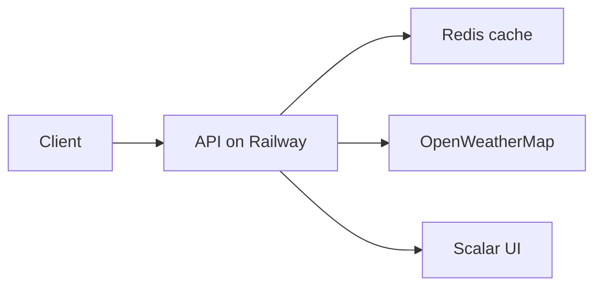

# Weather API

[](https://github.com/AdityaBabar08/Weather_API/actions/workflows/dotnet.yml)

## Purpose

The Weather API is a web API for ASP.NET Core. It gets current weather data and
weather forecasts from OpenWeatherMap. It stores the responses in a Redis cache.
It sends the responses to clients as JSON.

The free OpenWeatherMap tier has no daily forecast endpoint. The API combines
the 5-day forecast in 3-hour steps into daily minimum and maximum temperatures.
It calculates this in C#.

## Live demo

The API is deployed on Railway:

`https://weatherapi-production-8fb1.up.railway.app`

You can test the endpoints in the browser with the Scalar UI:

`https://weatherapi-production-8fb1.up.railway.app/scalar/v1`

The free Railway plan sleeps the service after 10 minutes without traffic.
The first request after a sleep takes a few seconds to wake the service.

The API has three endpoints:

| Method | Route               | Description                         |
|--------|---------------------|-------------------------------------|
| GET    | `/weather/current`  | Get the current weather for a city. |
| GET    | `/weather/forecast` | Get the daily forecast for a city.  |
| GET    | `/health`           | Get the status of the Redis cache.  |

## Technology

| Component           | Technology                                  |
|---------------------|---------------------------------------------|
| Web framework       | ASP.NET Core (minimal API)                  |
| Language            | C#                                          |
| Weather data source | OpenWeatherMap                              |
| Cache               | Redis                                       |
| Cache client        | `IDistributedCache` (StackExchange.Redis)   |
| API UI              | Scalar (OpenAPI)                            |
| Rate limiting       | ASP.NET Core built-in (`AddRateLimiter`)    |
| Deploy              | Docker + Railway                            |
| CI                  | GitHub Actions                              |
| Test framework      | xUnit                                       |

## Architecture



The API runs in a Docker container on Railway. Railway runs the Redis database
as a separate managed service. The API connects to it over the private network.

## Prerequisites

- Install the .NET 10 SDK.
- Install Docker Desktop.
- Get a free OpenWeatherMap API key.

A new API key can take 1 to 2 hours to activate.

## Setup

### Step 1: Start Redis

Run this command in the repository root:

```powershell
docker compose up -d
```

This command starts a Redis container. The API connects to the container on
port 6379.

### Step 2: Set the API key

The API key is not stored in the repository. Store it with user secrets.

Run these commands in the `WeatherApi` directory:

```powershell
dotnet user-secrets init
dotnet user-secrets set "OpenWeather:ApiKey" "your-key-here"
```

### Step 3: Run the API

Run this command in the repository root:

```powershell
dotnet run --project WeatherApi
```

In the Development environment, the API listens on these addresses:

- `https://localhost:7183`
- `http://localhost:5087`

## Use the API

These examples use curl. Replace `PORT` with the port from your launch profile.

Get the current weather for a city:

```powershell
curl "https://localhost:PORT/weather/current?city=Karachi"
```

Get the daily forecast for a city:

```powershell
curl "https://localhost:PORT/weather/forecast?city=Karachi&days=3"
```

The `days` parameter is optional. The default value is 5. The API limits the
value to the range 1 to 5.

Get the status of the Redis cache:

```powershell
curl "https://localhost:PORT/health"
```

The repository also contains `WeatherApi.http`. It has sample requests for the
VS Code REST Client.

### Test the degraded mode

Stop the Redis container:

```powershell
docker compose stop redis
```

The API still returns weather data. The `/health` endpoint reports `Degraded`.

Start the Redis container again:

```powershell
docker compose start redis
```

## How the cache works

The API uses the cache-aside pattern. It reads the cache before it calls
OpenWeatherMap.

1. The API makes a cache key from the request parameters. The city name is in
   lowercase. Example: `weather:current:karachi`
2. The API reads the key from Redis.
3. If the key exists, the API returns the stored JSON. It does not call
   OpenWeatherMap.
4. If the key does not exist, the API calls OpenWeatherMap. It stores the
   response in Redis for 10 minutes.

The forecast cache key also contains the number of days.
Example: `weather:forecast:karachi:3`

The API works when Redis is down. The API uses try/catch blocks around all
cache operations. If Redis is not available, the API calls OpenWeatherMap
directly. The `/health` endpoint reports the status of Redis:

- `Healthy`: Redis is available.
- `Degraded`: Redis is not available.

## Design decisions

- The cache TTL is 10 minutes. Weather data changes quickly. A 10-minute TTL
  keeps the data new. It also keeps the number of API calls low. The free
  OpenWeatherMap tier permits 60 calls per minute and 1,000,000 calls per
  month.
- The API uses metric units. OpenWeatherMap returns temperatures in Kelvin
  when the units parameter is not set. The API sets `units=metric`.
- The forecast endpoint returns daily data. The API gets the 5-day forecast in
  3-hour steps. It combines the 3-hour entries by day. It calculates the
  minimum and the maximum temperature for each day.
- The API limits requests to 20 per minute per client. This protects the free
  OpenWeatherMap quota. A client that exceeds the limit gets a `429` response.
  The limit does not apply to `/health`.
- The API exposes OpenAPI in all environments. The Scalar UI at `/scalar/v1`
  lets a reviewer test the endpoints in the browser.
- The API responses do not contain the OpenWeatherMap response structure. The
  API maps the upstream data to its own DTOs. The API surface is independent
  of upstream changes.
- The API returns errors as JSON problem responses. It never returns an
  unhandled 500 response.

## Errors

| Condition                          | Status code |
|------------------------------------|-------------|
| The `city` parameter is missing or empty | 400 |
| OpenWeatherMap does not know the city | 404 |
| The API key is invalid             | 401 |
| OpenWeatherMap is not available    | 502 |
| The client exceeds the rate limit  | 429 |

## Configuration

The local `appsettings.json` file has these sections:

| Section                        | Purpose                                 |
|--------------------------------|-----------------------------------------|
| `OpenWeather:BaseUrl`          | The base URL of the OpenWeatherMap API  |
| `OpenWeather:Units`            | The unit system for the temperature     |
| `OpenWeather:ApiKey`           | The API key (set with user secrets)     |
| `Redis:ConnectionString`       | The address of the Redis server         |
| `Weather:CacheTtlMinutes`      | The TTL of the cache in minutes         |

## Deploy on Railway

The repository has a `Dockerfile` and a `railway.toml` at the root. Railway
builds the Docker image from the GitHub repository.

Set these variables on the Railway API service:

| Variable                    | Value                            |
|-----------------------------|----------------------------------|
| `Redis__ConnectionString`   | `${{Redis.REDIS_URL}}`           |
| `OpenWeather__ApiKey`       | Your API key                     |

Railway makes the `REDIS_URL` variable available on the Redis database
service. The reference `${{Redis.REDIS_URL}}` connects the API to Redis over
the private network. The API key is a secret. It exists only in the Railway
dashboard. It is never stored in the repository.

The free Railway plan has these limits:

- The service sleeps after 10 minutes without traffic.
- The monthly usage must stay under $1.
- Deploys are blocked during peak hours (8 AM to 8 PM local time).

## Tests

Run this command in the repository root:

```powershell
dotnet test
```

GitHub Actions runs the same command on every push to `master`. The tests
cover these behaviors:

- Cache miss: the service calls OpenWeatherMap and stores the response.
- Cache hit: the service returns the cached data. It does not call
  OpenWeatherMap.
- Redis down: the service still returns data from OpenWeatherMap.
- Forecast aggregation: the daily minimum and maximum temperatures are
  correct.
- Days limit: the service limits the number of days.

## Alternative provider

Visual Crossing (Timeline API) is a good alternative to OpenWeatherMap. It has
a similar free tier. The API maps upstream data to its own DTOs. A different
provider can be added without changing the API surface.